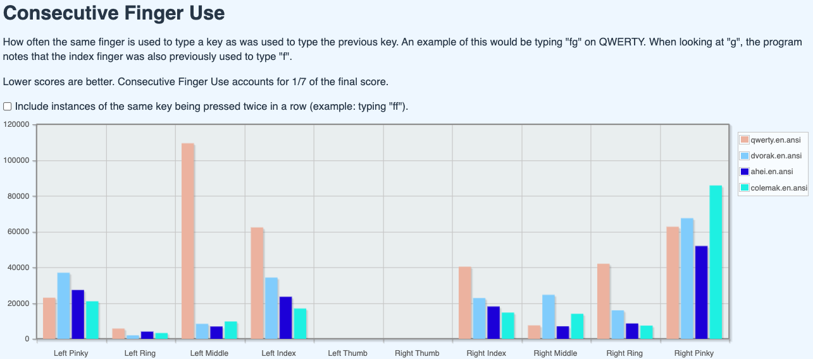

# The AHEI Keyboard Layout — An Improved Dvorak-Like Layout

## The AHEI layout — summary

I really like the Dvorak keyboard layout, but wanted to see if I could improve on it further. After some research and trying out ideas from other popular layouts, the result is the AHEI layout (named after the first letters on the home row). It outperforms several popular and optimized layouts (including the Dvorak and Colemak layouts) according to two different keyboard layout analyzers. The most common letters are easy to reach from the home position, and common two-letter combinations are rarely typed with the same finger. The layout is made to be easy to learn if you already are a Dvorak typist. 11 letters have the same positions as on Dvorak, and most of the other letters are close to where they are positioned on a Dvorak keyboard. Only two letters, `H` and `Q`, switch sides. The layout solves the Dvorak issue of having to stretch for the common letter `I`, while maintaining comfortable typing of the common bigram `OU`. It also decreases the load on the right pinky finger, and moves the moderately frequent letter `F` so that it doesn't require a long strech as in the Dvorak layout (for a normal staggered keyboard).

## Background and motivation

### The Dvorak layout
Quite a few years ago, I started to use the Dvorak keyboard layout instead of the normal QWERTY layout. After the initial learning phase, I was really happy about the upgrade. In my opinion, the typing experience is much nicer. The most common letters are placed on the home row, so that unnecessary streching to the other rows is avoided. Furthermore, all the vowels are placed to the left, while most consonants, and in particular the most common consonants, are placed to the right. This leads to a nice alteration between the hands, and avoids that many consecutive letters are typed with the same hand, and in particular with the same finger. However, a couple of years ago, I started to think about whether the layout could be further improved, and in that case how.

### Some issues with the Dvorak layout
When looking at the letter frequency heat map for the Dvorak keyboard, it seems that the most obvious improvement would be to switch `I` and `U`, since `I` is a much more frequent letter, and thus should be placed at one of the eight home keys, that don't require any stretch or lateral movement. An argument for not doing this is that `OU` is the most common vowel bigram (pair of letters that follow each other) in English, and this would be less comfortable to type if `I` and `U` were switched. The second most common criticism against the Dvorak keyboard is that it puts too much effort on the weak right pinky finger, which is assigned to two common letters: `S` and `L`.

### Best key positions
For the most popular alternative keyboard layouts, Dvorak and Colemak, it seems like the keys on the home row — including the keys in the middle columns — are viewed as the best positions. Some people argue that the lateral movement to reach the middle column requires more effort than moving some fingers up and down, and that the middle columns thus should be de-emphasized. This approach has been taken for many newer layouts, such as the Workman layout and the Colemak Mod-DH layout. Some computer-optimized layouts such as the MTGAP layout and the more recent Engram layout even avoid putting letters at all in the middle columns, and use some or all of those keys for punctuation marks.

### Design objectives
I used some ideas from these different layouts in order to modify the Dvorak with the goal of improving it. I wanted to keep the high degree of hand alteration, which is a feature I like with Dvorak, and therefore I wanted to keep all the vowels on the left-hand side, and most of the common consonants on the right-hand side. I also preferred to keep the keys close to their positions on Dvorak, since that's what I was used to, and it would thus be easier to learn the new layout. The main objective was to find a design such that all common bigrams (two-letter combinations) are comfortable to type. We would for example like to avoid having to type common bigrams with the same finger.

The best keys are obviously the eight home position keys (`ASDFJKL;` on a QWERTY keyboard), so we would like to place some of the most common letters there. Personally, I think that the second best keys are the ones above the middle and ring fingers' home positions, and the third best are probably above or under the index fingers' home positions. The reason that the keys above the index fingers aren't included in the second category is that I find them slightly harder to reach on a classical keyboard, when I have my hands slightly angled, for a more ergonomic wrist position. So, on the 12 best (in my opinion) keys, I would like to fit most of the common letters.

### Solution
One solution for the `U`-`I` problem, that is used in both the MTGAP and the Engram layout, is to place `O` above the `E` key, and `U` next to it. In this way, we can both fit the common letter `I` among the home keys, and at the same time type the common bigram `OU` comfortably, while keeping `O` at one of the second best keys. The second most common vowel bigram `IO` is also comfortable to type with this solution (more so than on Dvorak, where it requires a stretch). This leaves us with one free spot among the left-hand home keys. Since there are more common consonants than good positions on the right-hand side, it would make sense to move one of the consonants to the now free good spot on the left-hand side. The most common English bigram is `TH`, which, I assume, is why these letters are placed next to each other on Dvorak. However, after `TH`, we usually have a vowel, and most commonly `E`. `HE` is the second most common bigram. Thus, one idea is to move `H` to the left-hand side, so that combinations with `E` and other vowels are easy to type. Putting `H` on the old `O`-spot gives `HE` a nice inward roll, and `HA`, `HO` and `HI` are also nice and easy to type. At the same time, we have freed up one of the good spots on the right-hand side, so that we have more room among the good keys there for the common consonants.

The next step is to rearrange the consonants on the right-hand side so that the most frequent ones are on the best keys, while avoiding that common bigrams are typed with the same finger (i.e., keeping consecutive finger use low). After having tried out many options, I ended up with the result in the image above. The 11 most common letters, ETAOINSHRDL, all have a frequency above 4%, while the rest of the letters have a frequency of less than 3%. All these letters are now fitted into the 12 best positions on the keyboard.

One of the letter keys that requires the longest streches from the home position on a standard staggered keyboard is the Dvorak `F` position. This is an even less good position in our new layout, since this layout deemphasizes the middle columns, leading to that we even more often stay close to the home position. Therefore, I also made sure to remove the quite common letter `F` (2.2%) from there, and replace it with the second least common letter `Q` (0.1%). Also note that the finger assignments on the left-hand bottom row are displaced one step to the left, in accordance with the "angle mod" used for the Colemak Mod-DH layout. This makes it easier for the left wrist to keep an outwards angle, which contributes to a more ergonomic typing posture. The `J` has been moved away one step further from `K`, compared to Dvorak, to avoid having to type bigrams with `J` and a vowel with the same finger.

### Evaluation
To evaluate the layout, I mainly used the keyboard layout analyzer http://patorjk.com/keyboard-layout-analyzer. The new layout scores higher than all the ones that I have compared with, including Dvorak, Colemak, MTGAP and the newest Engram layout, for all of the three provided sample texts. These include the first chapter of Alice in Wonderland (results shown in the image), a list of the most commonly used words, and a list of most commonly used SAT words. The alteration between the hands for the first text is almost identical to the result for Dvorak, while it is significantly lower for Colemak, and slightly lower for the MTGAP and Engram layouts.

Later, I discovered a further developed version of this analyzer, https://klanext.keyboard-design.com/. I tried this out to compare the layout to some other common layouts using the "Chained English Bigrams 9" test, containing a large mass of text that should be representative for the English language in terms of having the same letter and bigram frequencies. The analyzer's score is a weighted sum of three different factors: the distance that your fingers move (40%), the amount of same-finger bigrams (40%), and the amount of hand alteration (20%). Comparing the AHEI layout to the most common layouts gave the following result, where a lower score is better (i.e., corresponds to less effort):

| Layout  | Effort | Overall Score | Distance | Same Finger | Same Hand |
| ------  | ------ | ------------- | -------- | ----------- | --------- |
| AHEI    | +0%    | 136.54        | 72.16    | 54.21       | 10.17     |
| Colemak | +3%    | 140.78        | 69.93    | 56.92       | 13.93     |
| Dvorak  | +13%   | 154.89        | 76.75    | 68.73       | 9.41      |
| QWERTY  | +53%   | 208.56        | 101.71   | 91.98       | 14.86     |

The result also includes heat maps for the different layouts, where you can see which keys are most frequently pressed and their distribution. The heatmaps for these four layouts are shown below. We can note that QWERTY places some very frequent keys in quite bad positions, while some of the better positions are wasted on very infrequent letters. The Dvorak heat map looks much better, with the most frequent letters placed in the middle row. However, we note that `I`, that is more frequent than `U`, requires a strech to the middle column, and that there is a lot of load on the pinky finger that has to handle two quite common letters: `S` and `L`. Also accessing the quite common letter `D` requires a strech to the middle column. The Colemak layout is obviously also much better than the QWERTY layout, but still requires some strech for two rather common letters, `D` and `H`, that are placed in the middle column. Furthermore, it doesn't follow the principle of placing all vowels on one side and all common consonants at the other side, which leads to less hand alteration compared to Dvorak and AHEI. The AHEI layout places the most frequent letters at the home positions or at the positions just above or under them that just require a small strech to access.

In the analyzer, we can also look at consecutive finger use for each layout. We can see that the consecutive finger use for different consecutive letters is lower for AHEI than for QWERTY and Dvorak for almost all fingers, and that it overall is lower than for Colmak as well. 

Also with the alternative analyzer https://colemakmods.github.io/mod-dh/analyze.html (where a low score is better), it gets a better score (1.77) than Dvorak (1.92), Colemak (1.84) and MTGAP (1.79). This analyzer uses a corpus with books from Project Gutenberg for evaluation (the same as used by the carpalx optimizer). The result here also shows that the AHEI layout is better at avoiding frequent same-finger bigrams than the Dvorak layout (which is seen by the first analyzer as well, by the diagram included in the image). The most common same-finger letter bigrams for Dvorak are `GH` (0.34%), `CT` 0.20%, `RN` (0.16%) and `UP` (0.16%). For the new layout, the top list instead consists of `KI` (0.13%), `UI` (0.10%) and `SC` (0.10%), of which `KI` and `UI` are present in the Dvorak layout as well. Furthermore, the distribution between the hands is a bit more even for AHEI (left 51.2%, right 48.8%), compared to Dvorak (left 45.3%, right 54.7%).

### Swedish variant
Finally, I also made a Swedish version of the layout, since I type a lot in Swedish as well. Like the SvDvorak layout, I have kept most of the non-letter keys as in the Swedish QWERTY layout, and added the three extra letters in the Swedish alphabet. Also in this variant, all the vowels are placed on the left-hand side, to maintain the alteration feature of the Dvorak layout. Trying it out with the first analyzer, using some news articles in Swedish, it also outperforms SvDvorak and a Swedish Colemak variant (and, needless to say, the Swedish QWERTY layout).

### Conclusion
After having given a lot of thought to this, and reaching a result that seems rather satisfying, I wanted to share my thoughts and results, in case that it could benefit someone else as well. It would be fun if someone else either wanted to try it out, or could use the ideas to construct a modification that suits them. I have now been using the Swedish variant of the layout myself for more than two years, and I'm still satisfied with it and haven't come up with any alternative letter distribution that I would prefer.

## Download and installation for macOS
1. Download the keyboard layout file ending in `.keylayout` (click on the file in the list of files and then on the download symbol "Download raw file" above the file content).
2. Open Finder, click *Go* in the menu at the top of the screen, and select *Computer*. Go to *Macintosh HD -> Library -> Keyboard Layouts*. (If *Library* doesn't appear, try holding down the *Option* key.)
3. Put the `.keylayout` file in that folder.
4. Restart the computer.
5. Open *System Preferences*, select *Keyboard* in the side menu. Find *Input Sources* and click the *Edit...* button.
6. Click the *+* symbol in the lower left corner of the window that appeared. Choose *Others* in the left-hand menu, select *AHEI* and click the *Add* button. The layout is now added, and the opened windows can be closed.
7. To switch to the layout, click the keyboard symbol at the top of the screen (it might look either like a keyboard or like one or a few letters in a box), and select *AHEI*.

## Remarks
### Previous version
In an earlier version of the layout, the `W` and `M` had switched positions compared to the current version. After some feedback and further testing, I concluded that this switch seemed to be an improvement.

### Finger assignment for number row
My focus has been on optimizing the letter keys, and my intention was to keep the number row as it is in the Dvorak layout (or the SvDvorak layout, in the case of the Swedish variant, in which the number keys are the same as in the Swedish QWERTY layout). However, in the English variant, the suggested finger assignment in the picture for the number row is slightly different from the default QWERTY one. The reason for this is that it was specified like that for the Dvorak layout, which was my starting point, in the keyboard layout analyzer. For the "Chained English Bigrams 9" test in the analyzer https://klanext.keyboard-design.com/, this non-standard finger assignment gives a slightly better score (136.54 compared to 136.98), so it might be a good idea. For the Swedish variant, the finger assignment is kept as the default one, simply because it was specified like that in the Swedish QWERTY variant that was my starting point in the layout analyzer. It's possible that the alternative finger assigment would be advantageous for the Swedish variant as well. However, since the parentheses, which are the most used keys on the row, are displaced by one step in the English variant compared to the Swedish one, there might be some extra motivation for a non-standard finger assignment for the English variant, since it would entail that stronger fingers are used for the parentheses. Personally, I use the Swedish variant with the default finger assigment as indicated in the picture, mainly because that's what I'm used to, but this is an option that you could experiment with if you want to.